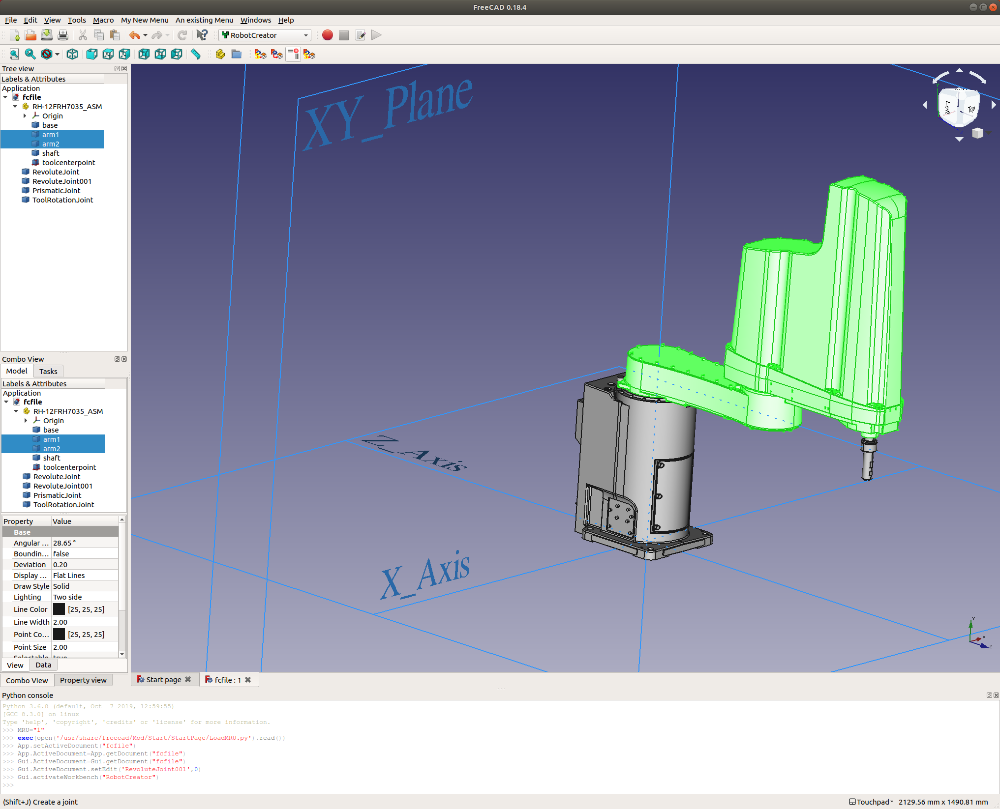
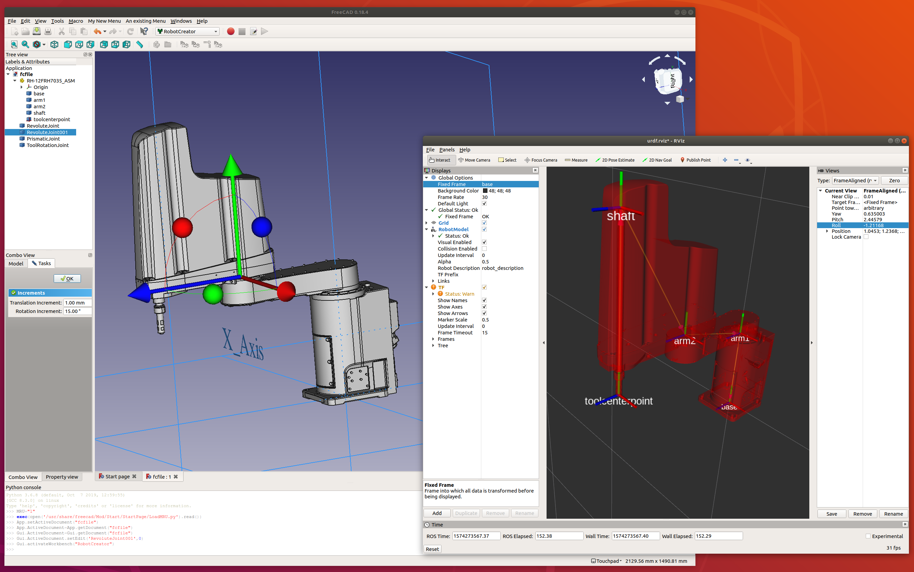

# FreeCAD RobotCreator Workbench

FreeCAD Workbench to create URDF files from e.g. STP or other CAD file formats.
*This project works for simple robots right now, but it hasn't been fully tested.*

## Installation

In order to install this FreeCAD plugin, install FreeCAD and clone this repository into the `~/.FreeCAD/Mod/` folder. Like so:

```
mkdir -p ~/.FreeCAD/Mod/
cd ~/.FreeCAD/Mod/
git clone https://github.com/RoboStack/RobotCreator
```

Then restart FreeCAD and the RobotCreator Workbench should appear.
Note: for the URDF export, you also need to have `BeautifulSoup4` and `lxml` installed.



The robot, running in RViz.



## Feedback

Please open issues on this repository for questions, or suggestions.

## Development

You can test e.g. the export function by opening the Python console in FreeCAD and executing:

```
# python 3:
import importlib as imp; import ExportURDF; imp.reload(ExportURDF).export_urdf()
# python 2:
import ExportURDF; reload(ExportURDF).export_urdf()
```